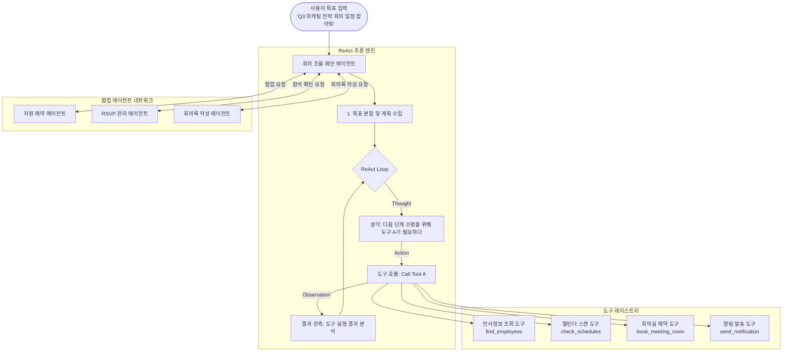

# AI Meeting Coordinator - Agentic AI 구조 개선 제안서

본 제안서는 기존의 순차적 위저드(Linear Stepper) 방식인 `ai-meeting-coordinator` 프로젝트를, **실제 대형언어모델(LLM) 에이전트의 작동 원리와 유사한 자율형 멀티 에이전트(Autonomous Multi-Agent) 구조**로 고도화하기 위한 아키텍처 및 구현 방안을 정의합니다.

---

## 1. 아키텍처의 핵심 변화 (As-Is vs To-Be)

기존 시뮬레이터는 정해진 단계(1~10단계)를 버튼 클릭에 따라 순차적으로 밟아가는 정적 상태 머신에 가깝습니다. 이를 보다 **Agentic**하게 바꾸기 위해 다음과 같이 구조를 전환합니다.

| 구분 | As-Is (현재 구조) | To-Be (Agentic 구조) |
| :--- | :--- | :--- |
| **작동 방식** | 사용자가 버튼을 클릭하면 다음 정해진 함수가 호출됨 (정적 흐름) | 사용자가 자연어로 목표(Goal)를 입력하면, 에이전트가 계획(Planning)을 수립하고 도구(Tools)를 자율 선택해 실행 |
| **추론 루프** | 사전 정의된 시나리오에 따라 화면 전환 | **ReAct (Reasoning + Acting)** 루프를 가상으로 구동하여 Thought $\rightarrow$ Action $\rightarrow$ Observation $\rightarrow$ Thought 흐름을 시각화 |
| **시스템 구조** | 단일 메인 컨트롤러가 모든 상태와 UI를 직접 제어 | 역할이 분담된 **멀티 에이전트(Multi-Agent)** 간의 협업 체계 |
| **에러/예외 처리** | 일정 충돌이 발생하면 사용자에게 강행 여부를 바로 질문 | 충돌 발생 시 에이전트가 스스로 다른 시간대를 조회하고 대안을 마련하여 보고 (Self-Correction) |

---

## 2. Agentic AI 아키텍처 다이어그램

개선된 시스템은 아래와 같이 **ReAct 추론 루프**, **도구 레지스트리(Tool Registry)**, 그리고 **역할별 서브 에이전트** 간의 메시지 교환으로 구성됩니다.



---

## 3. 핵심 구현 구성 요소 (Javascript 설계)

### 1) ReAct 실행 엔진 (Agentic Engine)
에이전트의 "생각(Thought) - 행동(Action) - 결과관측(Observation)" 루프를 시뮬레이션할 수 있는 비동기 상태 머신을 도입합니다.

```javascript
// src/agent/engine.js (가상 구조 예시)
class AgenticEngine {
  constructor(state, tools) {
    this.state = state;
    this.tools = tools;
    this.logs = []; // 에이전트의 Inner Monologue (생각 로그)
  }

  async executeGoal(goalDescription) {
    this.logs = [];
    this.addLog("Thought", `사용자의 요청 "${goalDescription}"을 접수했습니다. 필요한 도구와 참석자를 파악하겠습니다.`);
    
    // Step 1: 안건 분석 및 참석자 추천 도구 실행
    const empList = await this.callTool("find_employees", { query: goalDescription });
    this.addLog("Observation", `안건 키워드 매칭 결과 필수 참석자 3명(김마케, 이디자, 박예산)을 탐색했습니다.`);
    
    // Step 2: 캘린더 스캔 및 충돌 확인
    this.addLog("Thought", `선택한 시간(14:00)에 참석자들의 캘린더 일정을 스캔하겠습니다.`);
    const scheduleReport = await this.callTool("check_schedules", { users: empList, time: "14:00" });
    
    if (scheduleReport.hasCollision) {
      this.addLog("Observation", `일정 충돌 감지! 김마케(14:30~15:30), 이디자(14:00~15:00) 선약 있음.`);
      this.addLog("Thought", `충돌을 해결하기 위해 참석자 전원이 비어있는 다른 골든 타임을 검색하겠습니다.`);
      
      const goldenTime = await this.callTool("find_free_slot", { users: empList });
      this.addLog("Observation", `대안 시간 발견: 16:00 ~ 17:30 (충돌 없음).`);
      
      // 예약 진행
      this.state.selectedTimeStart = goldenTime.start;
      this.state.selectedTimeEnd = goldenTime.end;
    }
    
    // Step 3: 회의실 예약 에이전트 협업
    this.addLog("Thought", `참석 인원(4명)을 수용할 수 있는 최적의 회의실 예약을 자원 예약 에이전트에게 요청합니다.`);
    const roomBooking = await this.callTool("book_meeting_room", { capacity: 4 });
    this.addLog("Observation", `자원 예약 에이전트가 '크리에이티브룸'을 예약했습니다.`);
    
    // 최종 보고
    this.addLog("Output", `조율을 성공적으로 마쳤습니다! 5월 29일 16:00, 크리에이티브룸으로 예약을 확정하고 알림을 보냅니다.`);
  }

  addLog(type, text) {
    this.logs.push({ type, text, time: new Date() });
    // UI 업데이트 트리거 호출
    this.onLogUpdated?.(this.logs);
  }
}
```

### 2) 도구 레지스트리 (Tool Registry)
에이전트가 자율적으로 실행할 수 있도록 기존 로직을 '도구(함수)' 형태로 래핑하고 규격화합니다.

```javascript
const agentTools = {
  find_employees: async (args) => {
    // 키워드 매칭을 통해 매칭되는 직원 목록 반환
    return EMPLOYEES.filter(emp => ...);
  },
  check_schedules: async (args) => {
    // 특정 시간의 일정 중복 여부 체크
    return checkCollision(args.users, args.time);
  },
  book_meeting_room: async (args) => {
    // 자원 에이전트를 호출하여 회의실 예약 시도
    return resourceAgent.reserveRoom(args.capacity);
  }
};
```

---

## 4. UI/UX 디자인 개선 방안 (프리미엄 에이전트 대시보드)

현재의 단조로운 버튼 중심 화면 대신, **에이전트의 뇌 속(생각의 흐름)을 실시간으로 들여다보는 듯한 프리미엄 UI**를 제안합니다.

1. **Inner Monologue (에이전트 생각 로그) 터미널**:
   * 대시보드 중앙에 배치된 개발자 콘솔 스타일의 윈도우.
   * `Thought` (보라색), `Action` (하늘색), `Observation` (연두색) 태그와 함께 타이핑 애니메이션으로 에이전트의 사고 흐름이 실시간 출력됨.
   * 예: `[Thought] 일정 충돌을 회피하기 위해 대체 시간대를 검색하고 있습니다... 🔍`
2. **협업 에이전트 활성화 위젯**:
   * 화면 상단이나 측면에 `Coordinator Agent`, `Resource Agent`, `Scribe Agent`의 아바타 또는 인디케이터가 배치됨.
   * 자원 예약 단계에서는 `Coordinator Agent`에서 `Resource Agent`로 데이터가 이동하는 파티클(Particle) 애니메이션을 가시화.
3. **자율 모드 (Auto-run) vs 반자율 모드 (Human-in-the-loop) 토글**:
   * **자율 모드**: 사용자가 회의 목적만 적고 실행하면, 에이전트가 알아서 일정 검색, 충돌 방지, 방 예약, 메일 발송까지 원클릭으로 한 번에 질주하고 결과를 보고함.
   * **반자율 모드**: 에이전트가 각 중요한 단계(예: 일정 충돌 대안 수립 완료 등)에서 사용자에게 컨펌(Approval)을 구하는 모드.

---

## 5. 단계별 적용 전략 (구현 로드맵)

* **1단계: ReAct 추론 시뮬레이터 구축**
  * `main.js`의 `SimulationEngine`을 ReAct 아키텍처 패턴으로 변경.
  * 중앙 에이전트 챗봇 창 아래에 **[Agent's Inner Monologue]** 라는 이름의 시각화 컴포넌트 추가.
* **2단계: 도구(Tooling) 및 API 모의 환경 추상화**
  * 기존 비즈니스 로직(인사 정보 검색, 캘린더 충돌 체크, 회의실 필터링)을 별도의 `tools` 객체로 격리.
* **3단계: 멀티 에이전트 간의 텔레메트리 시각화**
  * 두 에이전트(회의 보조, 자원 예약)가 협력할 때 주고받는 메시지 형식의 JSON 페이로드를 모달이나 콘솔 뷰로 사용자에게 노출하여 "Agentic"한 설득력을 극대화.

---

본 제안서의 방향성에 맞추어 `ai-meeting-coordinator` 프로젝트의 `main.js` 및 `index.html`을 수정/업그레이드할 수 있습니다. 피드백을 주시면 바로 구현 작업에 들어가겠습니다.
