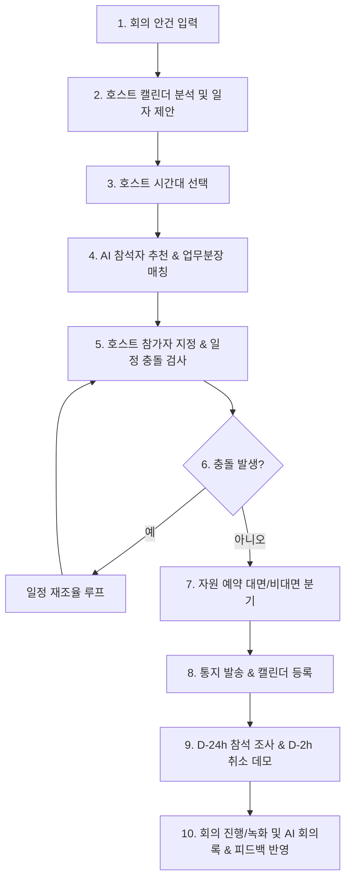

# AI Meeting Coordinator Agent Simulator 구현 계획서

본 프로젝트는 AI 기술을 활용하여 사내 임직원 간의 회의 일정을 스마트하게 조율하고, 회의 자료 준비, 참석자 자동 추천, 자원 예약, 사전 알림, 취소 전파, 그리고 회의록 자동 정리 및 피드백 반영까지의 **전 과정(End-to-End)을 가상으로 시뮬레이션하고 시각화할 수 있는 프리미엄 웹 애플리케이션**을 개발하는 것을 목표로 합니다.

호스트와 참가자의 역할을 오가며 AI 에이전트의 동작 원리와 실제 업무 적용 흐름을 한눈에 파악하고 직접 체험해볼 수 있는 대화형 시뮬레이터를 제공합니다.

---

## User Review Required

> [!IMPORTANT]
> **핵심 설계 방향성 및 사용자 검토 사항**
> 1. **시뮬레이션 중심의 UX**: 실제 구글 캘린더, 팀즈, 텔레그램 API를 직접 연동하기보다, 이들이 어떻게 연동되고 동작하는지 사용자가 시나리오를 주도하며 실시간으로 결과를 볼 수 있도록 **인터랙티브 대시보드(모의 캘린더, 가상 메신저 피드, 가상 메일함, 실시간 AI 에이전트 챗봇)** 형태로 구현합니다.
> 2. **2가지 핵심 에이전트 시각화**: '회의 보조 에이전트'와 '자원 예약 에이전트' 간의 협업 및 API 통신 과정을 시각화하여 멀티 에이전트 아키텍처를 직관적으로 이해할 수 있도록 설계합니다.
> 3. **풍부하고 고급스러운 인터페이스**: Vanilla CSS를 활용하여 Sleek Dark Theme, 유리 효과(Glassmorphism), 매끄러운 상태 전환 애니메이션을 전면 적용하여 시각적 완성도를 극대화합니다.

---

## Proposed Changes

새로운 프로젝트 디렉토리 `ai-meeting-coordinator`를 워크스페이스 내에 생성하고 Vite 기반으로 프리미엄 뷰를 구성합니다.

### 1. [NEW] [ai-meeting-coordinator](file:///c:/Users/buzz9/.antigravity/ai-meeting-coordinator)
회의 조율 및 관리 보조 에이전트 시뮬레이터 프로젝트의 루트 디렉토리입니다.

#### [NEW] [package.json](file:///c:/Users/buzz9/.antigravity/ai-meeting-coordinator/package.json)
- Vite 및 프로젝트의 실행과 빌드를 위한 메타데이터 파일입니다.

#### [NEW] [index.html](file:///c:/Users/buzz9/.antigravity/ai-meeting-coordinator/index.html)
- 시뮬레이터의 메인 구조를 정의하는 HTML5 파일입니다.
- SEO 최적화 및 시각적 레이아웃(호스트 캘린더, 참가자 리스트, 인사 시스템 직원 검색창, AI 챗봇 영역, 메신저 알림 피드, 화상회의/회의실 뷰어)을 세련되게 구조화합니다.

#### [NEW] [index.css](file:///c:/Users/buzz9/.antigravity/ai-meeting-coordinator/index.css)
- 프리미엄 웹 디자인을 위한 핵심 스타일시트입니다.
- HSL 기반의 세련된 다크 컬러 팔레트, 글라스모피즘 스타일, 스무스한 트랜지션, 가상 텔레그램 윈도우 스타일, 캘린더 그리드 스타일, 로딩/녹음 애니메이션 등을 구현합니다.
- 모바일 및 데스크톱에 최적화된 Grid/Flexbox 반응형 디자인을 제공합니다.

#### [NEW] [main.js](file:///c:/Users/buzz9/.antigravity/ai-meeting-coordinator/main.js)
- 시뮬레이터의 전체 비즈니스 로직과 상태를 제어하는 핵심 Javascript 파일입니다.
- **주요 기능 모듈**:
  - `AppState`: 현재 시뮬레이션 단계, 호스트 정보, 안건/자료, 추천 참가자 리스트, 회의 일정(호스트 및 참가자 개별 캘린더 데이터), 예약된 회의실, 이메일/메신저 알림 큐, 녹취록 및 피드백 회의록 데이터를 관리하는 리액티브 상태 저장소.
  - `SimulationEngine`: 사용자가 버튼을 클릭하거나 챗봇에 명령을 입력할 때마다 시나리오 단계를 부드럽게 전진시키고 화면 요소들을 동적으로 업데이트해주는 상태 머신.
  - `CalendarRenderer`: 호스트 및 필수 참가자들의 캘린더 일정을 24시간 그리드 또는 주간/일간 뷰로 그려주고, 겹쳐진 일정(충돌) 및 추천 예약 시간대를 시각화해주는 엔진.
  - `AgentLogic`: 회의명과 안건을 분석하여 인사 데이터(가상의 사내 임직원 데이터베이스)에서 연관 부서/업무 담당자를 검색해 참석자를 추천하는 AI 추천 로직 시뮬레이션.
  - `NotificationConsole`: 실시간으로 전송되는 이메일(Gmail 모의 뷰), 메신저(Telegram 모의 팝업), 화상회의 접속링크(Teams 모의 링크) 알림을 타임라인과 토스트로 보여주는 시스템.
  - `MeetingRoomReserver`: 자원 예약 에이전트 연동 모듈로, 수용 인원 및 실시간 회의실 상태에 맞게 예약 가능한 회의실을 동적 매핑해주는 로직.
  - `MinutesGenerator`: 가상 오디오 재생 및 실시간 텍스트 녹취록 스크롤링, 회의 종료 후 AI가 분류한 핵심 요약 및 피드백 수집 폼 렌더러.

---

## 시뮬레이션 프로세스 및 상세 시나리오 흐름

시뮬레이터는 사용자가 아래의 **10단계 비즈니스 프로세스**를 인터랙티브하게 체험할 수 있도록 설계됩니다:

### 1단계: 회의 안건 입력
- 호스트가 "회의명: 2026 Q3 마케팅 전략 수립 회의", "안건: 브랜드 인지도 제고 방안 및 플랫폼 광고 예산 수립", "회의 자료: Q3_Marketing_Draft.pdf (가상 첨부)" 등의 정보를 AI에게 입력.
- AI가 이를 접수하고 회의 성격을 즉각 파악하는 모션 제공.

### 2단계: 호스트 캘린더 검색 및 일자 제안
- AI가 호스트의 가상 캘린더 데이터를 실시간 검색하여, 다가오는 날짜 중 여유가 있는 3개의 후보 일자(예: 5/28, 5/29, 6/1)를 추천 카드로 시각화.

### 3단계: 호스트의 시간대 선택
- 호스트가 제안된 일자 중 하나(예: 5/29 금요일)를 클릭하고, 선호 시간(예: 14:00 ~ 15:30)을 슬라이더나 시간 그리드에서 드래그하여 선택.

### 4단계: AI 참석자 추천 (업무 분장 검색)
- AI가 회의명과 안건의 키워드("마케팅", "예산", "브랜드")를 분석.
- 가상의 인사 데이터(인사팀, 브랜드디자인팀, 기획예산팀 등의 직원 목록과 업무분장표)에서 적합한 후보자들을 자동 매칭하여 추천 목록 제시.
  - *예: 김마케 팀장(마케팅 총괄), 이디자 대리(브랜드 디자인), 박예산 과장(예산 기획)*

### 5단계: 참가자 역할 지정 & 일정 충돌 조회
- 호스트가 AI의 추천 참석자를 보고 `필수 참가자`, `선택 참가자`, `제외자`로 드래그앤드롭하여 분류를 확정.
- AI가 **필수 참가자들의 가상 캘린더**를 실시간으로 스캔.
- 호스트가 지정한 시간(14:00~15:30)에 다른 회의 일정이 있는 참가자(충돌 발생 인원)를 붉은색 타임 블록으로 표시하고 알림 제공.

### 6단계: 일정 재조율 (호스트-에이전트 인터랙션)
- 호스트는 "그냥 진행(강행)" 또는 "다른 시간으로 변경"을 클릭할 수 있음.
- "다른 시간으로 변경" 선택 시, AI가 필수 참가자 전원이 비어 있는 최적의 골든 타임(예: 16:00 ~ 17:30)을 재추천하고, 호스트가 이를 수락하면 최종 확정.

### 7단계: 회의 형태 분기 및 자원 예약
- **대면 회의 선택 시**: `자원 예약 에이전트`가 호출되는 시각 효과 발생. 회의 인원(예: 5명)을 수용할 수 있는 사내 회의실(예: 집단지성실 - 8인실, 크리에이티브룸 - 6인실) 중에서 예약 가능한 공간을 탐색 및 자동 예약. 호스트가 원하는 다른 공간으로 수동 지정도 가능. 예약 확정 시 캘린더에 위치 정보 추가.
- **비대면 회의 선택 시**: AI가 가상의 Teams/Zoom 화상회의 접속 주소를 즉시 생성하고 1시간 전 발송 대기열에 등록.

### 8단계: 통지 및 일정표 등록
- 최종 결정된 회의가 호스트 및 참가자(필수/선택)들의 가상 캘린더에 즉시 등록됨.
- 메인 대시보드의 '가상 이메일 전송함'에 전체 참가자 앞으로 상세 정보(회의 링크, 안건, 첨부 자료 등)가 포함된 이메일이 발송되는 애니메이션 실행.

### 9단계: 사전 조사 및 취소/변경 시뮬레이션
- **D-24h 참석 설문**: 회의 개최 24시간 전 시뮬레이션 버튼을 누르면, 참가자들의 스마트폰(가상 텔레그램 알림 피드)에 "참석 가능 여부(Yes/No)" 질문이 발송되고, 참가자들이 실시간 회신(일부는 참석, 일부는 불참 등)하여 그 결과가 요약 보고되는 과정 시연.
- **일정 변경/취소**: 
  - 개최 1일 전까지 자유롭게 시간 변경 가능 데모.
  - 개최 2시간 전까지 취소 가능 데모: 호스트가 "회의 취소 및 사유 입력(예: 긴급 현안 발생)"을 실행하면, 즉시 전원에게 이메일/메신저로 취소 통보가 날아가고, 각자 캘린더의 해당 회의 블록에 붉은색 취소선(Strikethrough)이 그어지는 시각적 연출.

### 10단계: 회의 진행 & 자동 회의록 피드백 루프
- 회의 시작 버튼을 클릭하면, 가상의 "회의 진행 및 녹음 중..." UI가 활성화되며, 실시간 음성인식 녹취록 스크롤(가상 텍스트)이 가동됨.
- 회의 종료 시, AI가 녹취록을 기반으로 **[요약본, 결정 사항, Action Item]**이 포함된 완성도 높은 회의록 초안을 생성.
- 호스트와 필수 참가자들에게 이메일로 피드백을 요청하고, 사용자가 직접 회의록에 피드백(텍스트 수정 또는 추가 사항 입력)을 주면, AI가 이를 즉시 반영하여 최종 완성본을 전체 참가자들에게 최종 공유(이메일 발송 완료)하는 것으로 시뮬레이션이 종료됨.

---

## Verification Plan

### 1. 시나리오 정합성 검증
- 호스트 일정 추천 -> 선호 시간 선택 -> 업무 분장 기반 참석자 추천 -> 필수 참가자 일정 조회 및 충돌 감지 -> 자원 예약(회의실 인원 수용 조건) -> 이메일/메신저 발송 -> 24시간 전 텔레그램 참석 여부 회신 -> 일정 변경 및 취소 시 취소선 렌더링 -> 녹화 및 녹취록 작성 -> 회의록 피드백 반영 및 공유의 전 과정이 누락 없이 매끄럽게 흐르는지 확인합니다.

### 2. 프리미엄 UI/UX 및 반응형 검증
- Chrome, Edge 등 주요 브라우저에서 다양한 화면 크기(반응형 데스크톱 및 태블릿)에 맞게 그리드 대시보드가 깨지지 않고 유려하게 표현되는지 확인합니다.
- 다크 모드 테마에서 가독성, 글라스모피즘 스타일의 잔상, 애니메이션 효과의 부드러움(FPS)을 검증합니다.
- Chrome DevTools의 Console에 에러가 없고 Clean Code 규칙이 완벽히 준수되었는지 검증합니다.

---

## Open Questions

> [!NOTE]
> 1. 시뮬레이션용 가상 임직원 목록(인사 시스템 데이터)의 부서와 이름은 IT 기획팀, 브랜드 전략팀, 재무 예산팀 등 사내 시나리오에 걸맞은 친숙한 한국어 이름들로 다채롭게 채워 넣어도 괜찮을까요? (기본적으로 매우 완성도 높은 모의 데이터를 기본 탑재할 계획입니다.)
> 2. 실제 회의 취소나 변경을 테스트할 때, 사용자가 직접 가상으로 시간 수정을 여러 번 반복해볼 수 있는 자유도 높은 타임라인 드래그 기능을 포함시켜 에이전트의 '조율 반복 과정'을 완벽하게 재현하고자 합니다. 이에 동의하시는지요?
